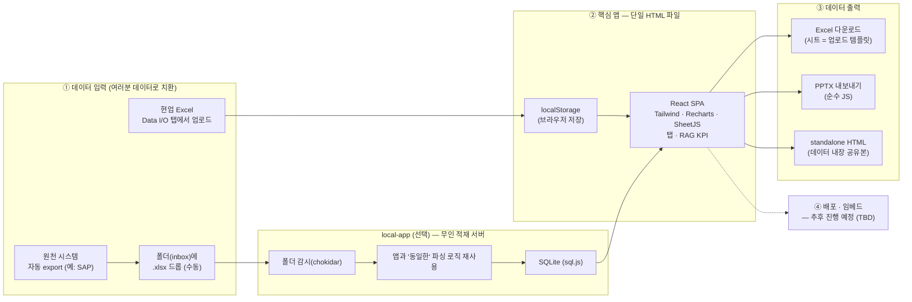

# 대시보드 구축 참고 가이드 (Dashboard Build Reference)

> **목적:** 자체 대시보드를 만들려는 **타 부서**가 참고하는 설계·구축 가이드.
> 이 문서는 **Cenobamate 공급망 대시보드**를 *사례*로 들어, 다른 부서가 그대로 따라 할 수 있는 **재사용 가능한 접근법 / 기술선택 / 구축 절차 / 주의점**을 정리한 것입니다.
> 👉 공급망·BOM 같은 **도메인 내용은 예시일 뿐**입니다 — 여러분 부서의 데이터·KPI로 치환하면 됩니다.

---

## 1. 핵심 아이디어 (이 방식의 정체)

**"빌드 과정 없는 단일 HTML 파일 React 앱 + Excel로 주고받는 데이터 + AI 코딩 어시스턴트로 반복 개발."**

- 서버·설치·복잡한 인프라를 최소화 → 파일 하나를 열거나 공유하면 끝.
- 데이터는 현업이 익숙한 **Excel**로 업로드/다운로드.
- 소수 사용자·빠른 반복·낮은 운영부담에 최적화된 패턴입니다.

---

## 2. 이 방식이 맞는 경우 / 다시 생각할 경우

| 잘 맞음 ✅ | 다시 생각 ⚠️ (다른 방식 권장) |
|---|---|
| 사용자 ~수십 명 내부용 | 수백~수천 동시 사용자 |
| Excel/수기로 관리되는 데이터 | 실시간 트랜잭션·스트리밍 |
| 빠른 반복·잦은 화면 변경 | 한번 굳히면 안 바뀌는 정형 리포트 |
| 인프라·운영 인력 최소화 | 대용량 DB·복잡한 백엔드 필요 |
| KPI 요약·모니터링(RAG) 성격 | 세밀한 행단위 권한·감사 추적 필수 |

> 위 오른쪽에 해당하면 BI 툴(Power BI 등)이나 정식 웹앱이 더 맞을 수 있습니다. 이 가이드는 **왼쪽** 상황을 위한 것입니다.

---

## 3. 아키텍처 한눈에



> **두 가지 데이터 경로 중 택일/병행:**
> - **간단 경로** — Data I/O 탭에서 Excel 업로드 → 브라우저 `localStorage` 저장 → 화면 반영. *서버 불필요.*
> - **무인 경로** — 파일을 `inbox` 폴더에 떨구면(수동 또는 자동 export) `local-app` 이 감시·파싱해 SQLite에 쌓고 대시보드에 주입.

---

## 4. 기술 스택 & 선택 이유 (그대로 쓰거나 갈아끼우세요)

| 영역 | 이 사례의 선택 | 고른 이유 | 대안 |
|---|---|---|---|
| UI 프레임워크 | **React** (babel-standalone, CDN) | 빌드 단계 없이 단일 파일에서 동작 | Vue, Svelte, (빌드형) React |
| 스타일 | **Tailwind** (CDN) | 무설치·빠른 스타일링 | 순수 CSS, Bootstrap |
| 차트 | **Recharts** | 선언적, React 친화 | Chart.js, ECharts |
| 날짜 | **Day.js** | 2KB 경량 | date-fns |
| Excel I/O | **SheetJS(XLSX)** | 브라우저에서 읽기/쓰기 | exceljs |
| 데이터 저장 | **localStorage** | 무서버, 즉시 | IndexedDB, (아래) local-app+SQLite |
| 무인 적재 | **Node + chokidar + sql.js** | 폴더감시→파싱→SQLite | Python watchdog 등 |
| 슬라이드 출력 | **순수 JS PPTX** | 외부 라이브러리 0 | pptxgenjs |

> 핵심은 **"빌드 도구 없이 CDN 라이브러리로 단일 HTML"** 라는 점. 프레임워크/차트는 취향껏 바꿔도 패턴은 동일합니다.

---

## 5. 데이터는 어떻게 흐르나 (입력 3경로 · 출력 3종)

**입력 (목적에 맞게 택일/병행)**
1. **수기 업로드 (가장 간단):** Data I/O 탭 → Excel 선택 → 시트별 변경 미리보기 후 적용 → `localStorage` 저장. *서버 전혀 불필요.*
2. **폴더 자동적재 (무인):** `local-app` 실행 → `inbox/` 감시 → 새 Excel을 **대시보드와 똑같은 로직**으로 파싱 → SQLite에 누적 + 대시보드에 주입. "새 데이터 적재됨" 배너로 새로고침 안내.
3. **원천 시스템 자동 export:** 외부 도구가 정해진 데이터를 Excel로 `inbox` 에 저장 → 위 2번으로 연결. *(이 사례는 SAP GUI Scripting을 사용 — 단, 서버측 스크립팅 활성화 등 **IT 협조 필요**.)*

**출력**
- **Excel 다운로드:** 현재 데이터를 다중 시트 .xlsx로. 각 시트가 곧 **업로드 템플릿**.
- **PPTX 내보내기:** 외부 라이브러리 없이 보고용 슬라이드 생성.
- **standalone HTML:** 현재 데이터를 HTML 안에 통째로 박은 공유본 — 열기만 하면 그 화면이 그대로(서버/업로드 불필요).

---

## 6. 핵심 설계 결정 (왜 이렇게 했나 — 그대로 권장)

- **단일 HTML + babel-standalone → 빌드 단계 없음.** `npm run build` 없이 파일 하나로 실행·공유·핸드오버.
- **localStorage 영속화 + RAG(Red/Amber/Green) 체계.** 임계값은 별도 탭에서 조정하고 Excel로도 export/import.
- **Data I/O를 "스키마 주도"로.** 각 시트를 `path`(JSON 경로)·`kind`·`columns` 로 정의 → 업로드/다운로드/템플릿이 **한 정의에서** 자동 생성. (가장 따라 하기 좋은 부분)
- **파싱 로직 1벌 유지.** `local-app` 이 자체 파서를 따로 만들지 않고, 빌드 스크립트가 **앱의 파싱 함수를 그대로 추출**해 동일하게 파싱 → "앱에서 본 것 ≠ 서버가 적재한 것" 류 불일치를 원천 차단.

---

## 7. 처음부터 만들기 — 단계별 시작 가이드

> **가정:** 아무 코드도 없는 **맨바닥에서 시작**. 예시는 **Project Management 팀의 프로젝트 포트폴리오 대시보드**(프로젝트·마일스톤·예산·리스크/이슈, RAG 상태)로 듭니다. 데이터 항목만 여러분 것으로 바꾸면 그대로 적용됩니다.

**0단계 — 무엇을 보여줄지(정보 설계) 먼저.**
대시보드가 답할 질문 3~5개를 정합니다. 예) *"지금 빨간(Red) 프로젝트는?", "이번 분기 마일스톤 달성률은?", "예산 편차가 큰 프로젝트는?"* → 이게 곧 **탭 구성**(요약 + 상세)이 됩니다.

**1단계 — 데이터 모델 = Excel 시트 설계 (★ 가장 중요).**
화면보다 **데이터를 먼저** 정합니다. 시트·컬럼을 표로:
| 시트 | 컬럼(예) |
|---|---|
| Projects | 프로젝트, PM, 단계, RAG, 시작일, 목표종료일, 진척률(%) |
| Milestones | 프로젝트, 마일스톤, 목표일, 실제일, 상태 |
| Budget | 프로젝트, 예산, 실적 |
| Risks | 프로젝트, 리스크/이슈, 영향도, 대응, 상태 |

**2단계 — 빈 단일 HTML 골격 만들기 (빌드 도구 없음).**
파일 하나(`pm-dashboard.html`)에 CDN 스크립트 + 최소 React 마운트만 넣습니다. **브라우저로 열면 바로 동작**합니다(서버·빌드 불필요):
```html
<!DOCTYPE html><html lang="ko"><head><meta charset="utf-8"/>
<script src="https://cdn.tailwindcss.com"></script>
<script src="https://unpkg.com/react@18/umd/react.production.min.js"></script>
<script src="https://unpkg.com/react-dom@18/umd/react-dom.production.min.js"></script>
<script src="https://unpkg.com/recharts/umd/Recharts.min.js"></script>
<script src="https://cdn.jsdelivr.net/npm/dayjs@1/dayjs.min.js"></script>
<script src="https://cdn.sheetjs.com/xlsx-latest/package/dist/xlsx.full.min.js"></script>
<script src="https://unpkg.com/@babel/standalone/babel.min.js"></script>
</head><body><div id="root"></div>
<script type="text/babel">
  const { useState, useEffect } = React;
  const KEY = 'pm_dashboard_v1';
  const INIT = { projects: [], milestones: [], budget: [], risks: [] }; // ← 1단계 스키마
  function App(){
    const [data,setData] = useState(()=>JSON.parse(localStorage.getItem(KEY)||'null')||INIT);
    useEffect(()=>localStorage.setItem(KEY,JSON.stringify(data)),[data]);
    return <div className="p-6">
      <h1 className="text-xl font-bold">PM Dashboard</h1>
      {/* 여기에 탭·차트 추가 */}
    </div>;
  }
  ReactDOM.createRoot(document.getElementById('root')).render(<App/>);
</script></body></html>
```

**3단계 — 데이터 저장/로드 배선.** 위 골격처럼 `localStorage` 에 읽고/쓰고, `INIT` 에 1단계 스키마대로 시드 데이터를 채웁니다.

**4단계 — Excel 업로드/다운로드(Data I/O) 붙이기.** SheetJS로 (a) 현재 데이터를 시트별로 **내보내기(=빈 템플릿 겸용)**, (b) 채운 파일을 다시 읽어 `data` 갱신. → 현업이 Excel로 데이터를 관리.

**5단계 — 탭·차트 구현.** 요약 탭(빨간 프로젝트 수, 마일스톤 달성률)부터, 상세 탭(프로젝트 목록·타임라인·예산 편차)으로 확장. 차트는 Recharts.

**6단계 — RAG·임계값(Targets).** Green/Amber/Red 규칙을 정해(예: 일정 지연 ≤1주 Green, ≤2주 Amber, 초과 Red) Targets 탭에서 조정 가능하게.

**7단계 — 검증·공유.** 실제와 비슷한 데이터로 확인 → **standalone HTML 내보내기**로 데이터 내장 공유본 전달.

> **나중에(선택):** 데이터가 잦/대량이면 `local-app`(폴더 자동적재)을, 원천 시스템 연동이 필요하면 자동 export를 추가. **배포(호스팅·임베드)는 별도 과제로 추후 진행.**
>
> 💡 개발은 **AI 코딩 어시스턴트**로 단일 파일을 반복 수정하면 빠릅니다. **"데이터 모델 먼저, 화면은 그 위에"** 순서를 지키세요.

---

## 8. 실행 방법

- **그냥 보기:** HTML 파일 더블클릭(브라우저). 데이터는 본인 브라우저 localStorage에 저장됨.
- **무인 적재로 쓰기:** `local-app/` 에서 `npm install && npm start` → `http://localhost:3000`. `inbox/` 에 Excel 떨구면 자동 반영. (`npm run build:exe` 로 단일 exe 패키징도 가능)
- **배포:** 아직 미정 — **추후 진행 예정.** (웹 호스팅·SharePoint/Teams 임베드 등은 결정 후 반영)

---

## 9. 개발 방식 (참고하면 좋은 팁)

- **AI 코딩 어시스턴트로 반복 개발.** 현업 피드백 → 단일 파일에 즉시 반영 → 바로 확인. 작은 변경을 빠르게 누적.
- **데이터 모델 먼저, 화면은 그 위에.** 어떤 Excel/시트를 주고받을지부터 정하고 탭·차트·KPI를 얹음.

---

## 10. 주의점 · 교훈 (다른 부서가 미리 알아두면 좋은 것)

- **데이터 민감도:** 실데이터를 다루면 저장소는 **private**, 배포 시 **인증 뒤**에 두기. (이 사례도 repo는 private.)
- **localStorage 한도:** 브라우저 저장은 수 MB 수준 — **대용량이면 local-app + SQLite 경로**를 쓰세요.
- **단일 파일 크기:** 기능이 늘면 HTML이 커집니다(이 사례 ~1.4MB). 관리 가능하나 인지는 하고 시작.
- **원천 시스템 연동은 IT 의존:** SAP 자동화는 서버측 스크립팅(`sapgui/user_scripting=TRUE`) 등 **IT 승인**이 한 번은 필요 — 안 되면 **수동 export → 폴더 드롭**으로 대체 가능.
- **배포는 별도 과제:** 데모/공유는 단일 파일로 충분하지만, 정식 배포(호스팅·임베드·인증)는 별도로 결정·진행해야 합니다.

---

## 부록 A. 이 사례의 도메인 (참고만)

이 사례는 SK Biopharmaceuticals 의 **Cenobamate 상업 공급망**을 다룹니다(RSM→API→DP→Semi-FP→FP, 시장별 파트너/CMO). 도메인 구조는 `docs/Cenobamate_BOM_Tree_v3.md` 참고 — **여러분 부서엔 그대로 필요 없는 내용**이며, 같은 *틀*에 여러분 데이터를 넣는 것이 포인트입니다.

## 부록 B. 이 레포의 폴더 (사례 구현)

| 위치 | 무엇 |
|---|---|
| `gsm-dashboard.html` | **핵심** — 전체 UI+로직 단일 파일 |
| `local-app/` | 폴더 자동적재 + 서버 (Node, SQLite, exe 패키징) |
| `sap-export/` | 원천(SAP) 자동 export (Python, GUI Scripting) |
| `docs/` | 도메인·핸드오프·가이드 문서 |

> `spfx/`, `GSM Dashboard/`, `staticwebapp.config.json` 등 배포·임베드 관련 POC 자료도 일부 있으나 **배포 방식은 미정(추후 진행 예정)** 입니다.

---

*이 문서는 타 부서 전달용 참고 자료입니다. 사례 구현이 바뀌면 §3 다이어그램·부록 B를 함께 갱신해 주세요.*
